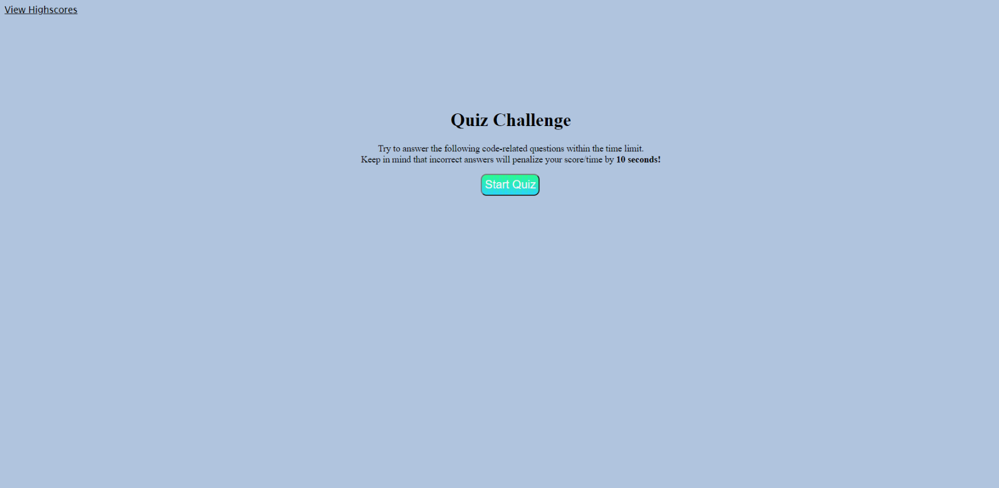

# code-quiz

## Description
This week’s challenge was to build a timed coding quiz with multiple-choice questions. This app will run in the browser, and will feature dynamically updated HTML and CSS powered by JavaScript code. It will have a clean, polished, and responsive user interface.

## Table of Contents
* [User Story](#userStory)
* [Acceptance Criteria](#acceptanceCriteria)
* [Installation](*installation)
* [Usage](#usage)
* [Website Links](#websiteLinks)
* [Screengrab](#screengrab)
* [Languages](#languages)
* [License](#license)

### User Story
`AS A coding boot camp student
I WANT to take a timed quiz on JavaScript fundamentals that stores high scores
SO THAT I can gauge my progress compared to my peers`

### Acceptance Criteria
`GIVEN I am taking a code quiz
WHEN I click the start button
THEN a timer starts and I am presented with a question
WHEN I answer a question
THEN I am presented with another question
WHEN I answer a question incorrectly
THEN time is subtracted from the clock
WHEN all questions are answered or the timer reaches 0
THEN the game is over
WHEN the game is over
THEN I can save my initials and score`

### Installation
No installation required - click the link below to view application.

### Usage
Throughout the quiz, the user will be asked simple coding questions to test their knowledge.

### Website Link
[Start Quiz](https://brynne-eastman.github.io/Web_APIs_Challenge-Code_Quiz/)

### Screengrab

### Languages
- HTML
- CSS
- JavaScript

### License
MIT

